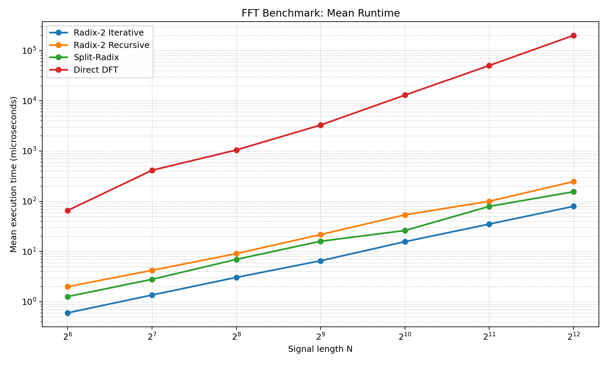
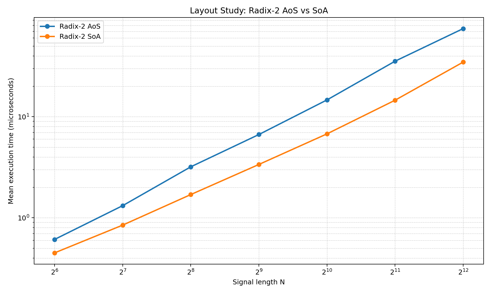
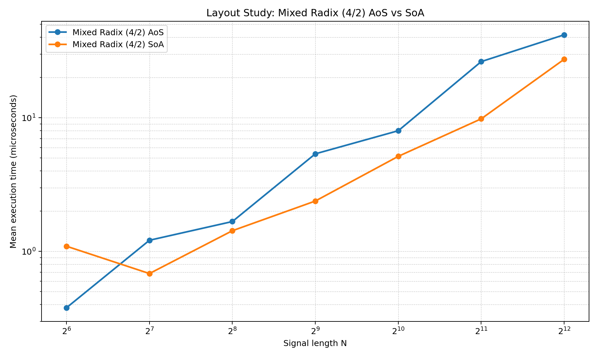

# FFT Optimization Research

C++20 framework for developing and comparing FFT algorithms with a correctness-first baseline.

## Included algorithms

- `radix2_aos`: iterative radix-2 FFT with `std::complex<double>` layout (AoS)
- `mixed42_aos`: iterative mixed radix (4/2) FFT with `std::complex<double>` layout (AoS)
- `radix2_recursive`: recursive radix-2 Cooley-Tukey
- `split_radix`: split-radix FFT
- `direct_dft`: exact \(O(N^2)\) DFT reference
- Layout-optimization variants: `radix2_soa`, `mixed42_soa`

## Build

```bash
cmake -S . -B build -DCMAKE_BUILD_TYPE=Release
cmake --build build --config Release
```

## Run tests

```bash
ctest --test-dir build -C Release --output-on-failure
```

## Demo

```bash
./build/fft_demo --N 1024 --tone 37 --algorithm radix2_aos --complex_tone
./build/fft_demo --N 1024 --tone 37 --algorithm mixed42_aos --complex_tone
./build/fft_demo --N 1024 --tone 37 --algorithm radix2_soa --complex_tone
./build/fft_demo --N 1024 --tone 37 --algorithm mixed42_soa --complex_tone
```

## C++ benchmark (CSV output)

```bash
./build/fft_benchmark \
  --sizes 64,128,256,512,1024,2048,4096 \
  --algorithms radix2_aos,mixed42_aos,radix2_recursive,split_radix,direct_dft \
  --iterations 40 \
  --warmup 5 \
  --csv fft_benchmark_summary.csv \
  --raw_csv fft_benchmark_raw.csv
```

The benchmark exports multiple comparable timing metrics per algorithm and size:

- `mean_us`, `median_us`, `min_us`, `max_us`, `stddev_us`, `p95_us`
- `time_per_sample_ns`, `time_per_nlog2n_ns`, `throughput_samples_per_s`

## Automated benchmarking + plotting (Python)

```bash
python3 scripts/fft_benchmark_plot.py \
  --build-dir build \
  --config Release \
  --sizes 64,128,256,512,1024,2048,4096 \
  --algorithms radix2_aos,mixed42_aos,radix2_recursive,split_radix,direct_dft \
  --iterations 40 \
  --warmup 5 \
  --output-dir benchmark_results
```

By default, the script runs two studies and synchronizes outputs to both `benchmark_results` and `docs/figures`:

- Primary algorithmic study (original comparison set) in the root output folder.
- Secondary layout study (AoS vs SoA) in `layout_optimization/`.

Generated artifacts:

- `benchmark_results/fft_benchmark_summary.csv`
- `benchmark_results/fft_benchmark_raw.csv`
- `benchmark_results/mean_runtime.png`
- `benchmark_results/mean_runtime_us.png`
- `benchmark_results/p95_runtime_us.png`
- `benchmark_results/time_per_sample_ns.png`
- `benchmark_results/throughput.png`
- `benchmark_results/throughput_samples_per_s.png`
- `benchmark_results/layout_optimization/fft_layout_summary.csv`
- `benchmark_results/layout_optimization/fft_layout_raw.csv`
- `benchmark_results/layout_optimization/radix2_aos_vs_soa_runtime.png`
- `benchmark_results/layout_optimization/mixed42_aos_vs_soa_runtime.png`
- `benchmark_results/layout_optimization/speedup_vs_radix2_aos.png`

`matplotlib` is required for plots.

## Final optimization results (AoS vs SoA)

Using `docs/figures/layout_optimization/fft_layout_summary.csv` (40 iterations, 5 warmups), the final layout optimization shows consistent gains for SoA kernels.

- `radix2_soa` mean runtime improvement vs `radix2_aos`: `1.93x` average over `N=64..4096`
- `mixed42_soa` mean runtime improvement vs `mixed42_aos`: `1.62x` average over `N=64..4096`
- For `N >= 128`, `mixed42_soa` is the fastest kernel in this study
- Peak observed throughput: `214.81M samples/s` (`mixed42_soa`, `N=512`)

| Size (N) | radix2_aos (mean us) | radix2_soa (mean us) | Speedup | mixed42_aos (mean us) | mixed42_soa (mean us) | Speedup |
| --- | --- | --- | --- | --- | --- | --- |
| 1024 | 14.6696 | 6.7693 | 2.17x | 8.0032 | 5.1472 | 1.55x |
| 4096 | 74.4707 | 34.7303 | 2.14x | 41.8061 | 27.4085 | 1.53x |

### Baseline FFT vs best optimized kernel

For a direct comparison between a "normal FFT" baseline and the best optimized version in this project, we compare:

- Baseline: `radix2_aos` (iterative radix-2, AoS)
- Best optimized: `mixed42_soa` (mixed radix 4/2, SoA)

Using mean runtime from `docs/figures/layout_optimization/fft_layout_summary.csv`:

- Average speedup (`N=128..4096`): `2.69x`
- Maximum observed speedup: `3.61x` at `N=2048`

| Size (N) | radix2_aos (mean us) | mixed42_soa (mean us) | Speedup | radix2_aos throughput (M samples/s) | mixed42_soa throughput (M samples/s) |
| --- | --- | --- | --- | --- | --- |
| 128 | 1.3197 | 0.6832 | 1.93x | 96.99 | 187.35 |
| 1024 | 14.6696 | 5.1472 | 2.85x | 69.80 | 198.94 |
| 2048 | 35.4499 | 9.8258 | 3.61x | 57.77 | 208.43 |
| 4096 | 74.4707 | 27.4085 | 2.72x | 55.00 | 149.44 |

### Result figures





## Documentation

- `docs/fft_ieee_paper.tex`: IEEE-format paper root file
- `docs/dsections/`: section files used by the IEEE paper
